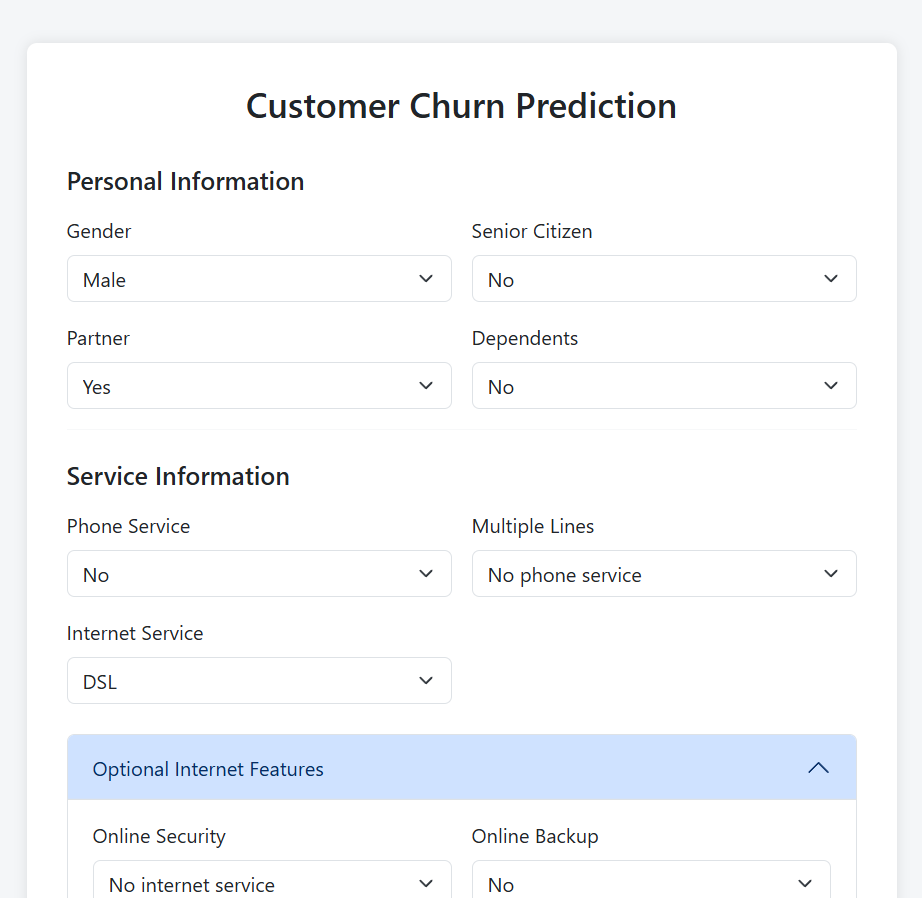
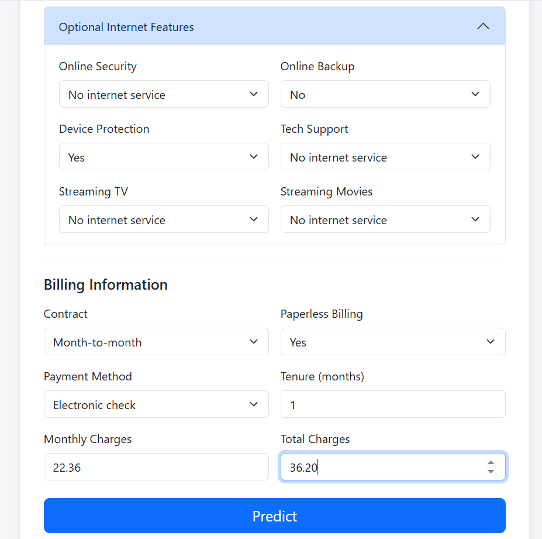
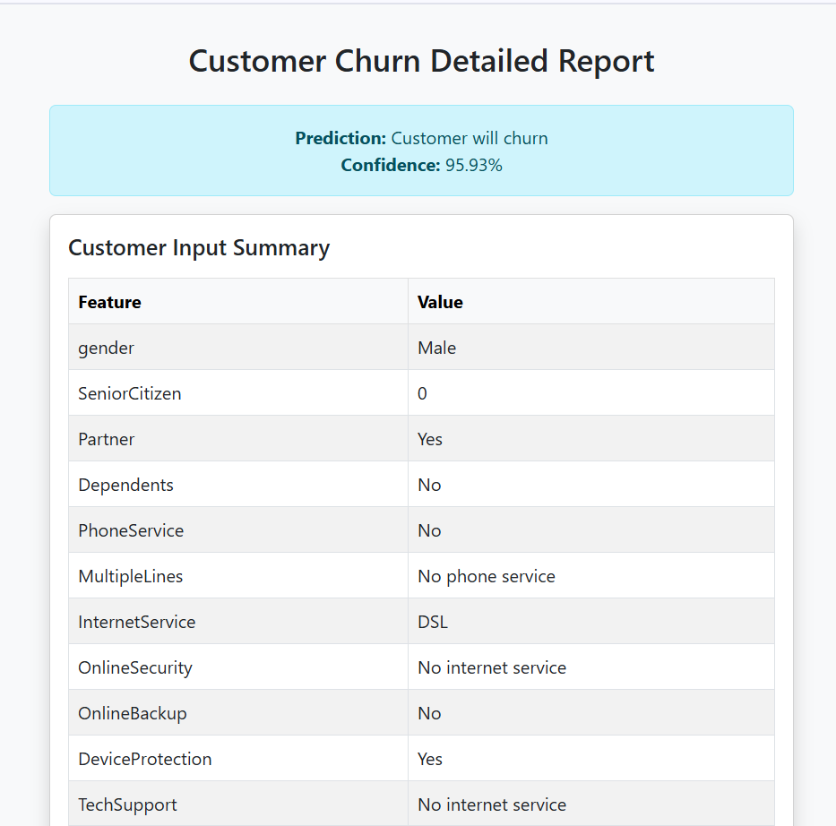
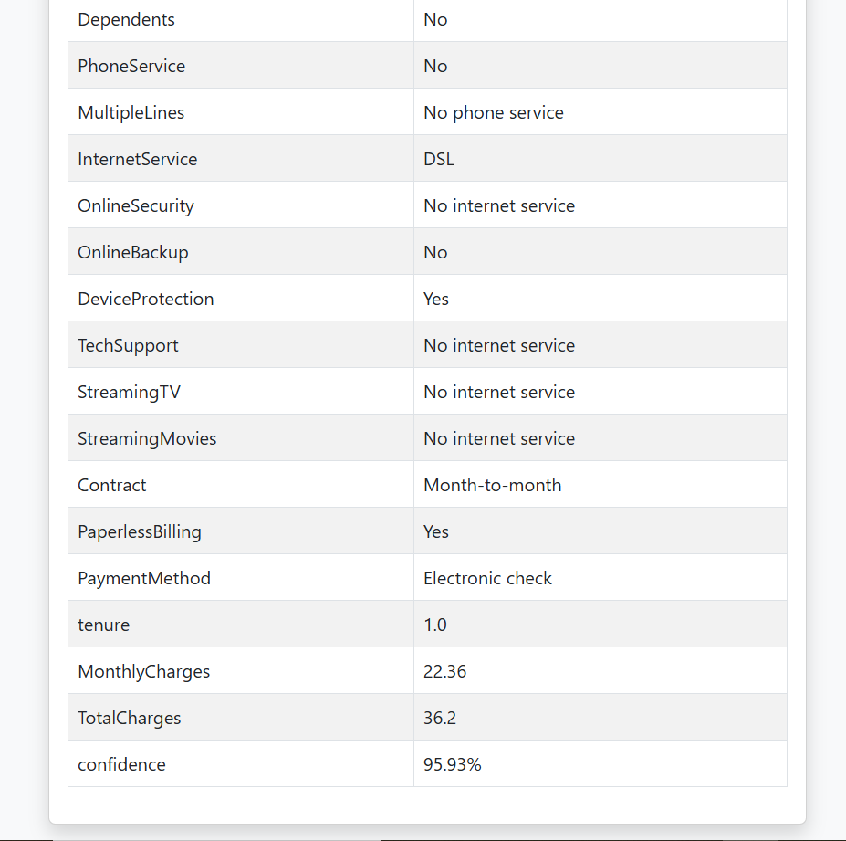
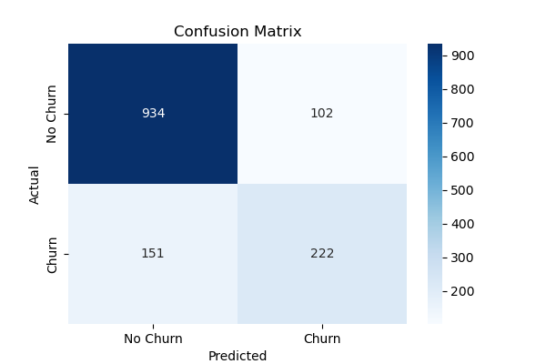

# 📊 Customer Churn Prediction using ML and Flask

This project is a full-stack machine learning application that predicts customer churn for a Telco company. It features a trained Logistic Regression model, preprocessing pipelines, a user-friendly Flask web interface, and visual performance reports.

---

## 🚀 Demo

Here are some screenshots of the live application:

### 🖼️ UI Demo

<p align="center">
  
  
</p>
<p align="center">
  
  
</p>

### ✅ Model Evaluation

<p align="center">
  
</p>

---

## 🧠 Machine Learning Overview

- **Model Used**: Logistic Regression  
- **Preprocessing**: Done using Scikit-learn Pipelines  
- **Feature Handling**:
  - Binary Encoding
  - One-Hot Encoding
  - Scaling with `StandardScaler`
- **Evaluation Metrics**: Accuracy, Precision, Recall, F1-Score, Confusion Matrix

---

## 🗂️ Project Structure

```
customer_churn_project/
│
├── app.py                        # Flask application
├── pipeline.py                   # Model training and pipeline
├── model.pkl                     # Trained pipeline model
├── requirements.txt              # Python dependencies
│
├── data/
│   └── telco_churn.csv           # Dataset
│
├── notebook/
│   └── customer_churn.ipynb            # Data exploration and model building
│
├── templates/
│   ├── index.html                # UI for input
│   └── report.html               # Detailed prediction report
│
├── modules/
│   ├── data_preprocessing.py
│   ├── feature_engineering.py
│   ├── model_evaluation.py
│   ├── model_training.py
│   └── model_utils.py            # Preprocessing utilities
│
├── img/
│   ├── demo1.png
│   ├── demo2.png
│   ├── demo3.png
│   ├── demo4.png
│   └── confusion_matrix.png      # Model performance
```

---

## 🛠️ Setup Instructions

1. **Clone the repository**  
   ```bash
   git clone https://github.com/vishal-benake/Customer-Churn-Prediction-ML-Flask.git
   cd Customer-Churn-Prediction-ML-Flask
   ```

2. **Create virtual environment (optional but recommended)**  
   ```bash
   python -m venv venv
   source venv/bin/activate    # On Windows: venv\Scripts\activate
   ```

3. **Install dependencies**  
   ```bash
   pip install -r requirements.txt
   ```

4. **Run the Flask app**  
   ```bash
   python app.py
   ```

5. Open your browser and navigate to `http://127.0.0.1:5000`

---

## 📈 Prediction Output

- The app shows whether a customer will churn or not.
- A detailed report page displays:
  - Input breakdown
  - Bar charts for numerical & binary features
  - Confidence score (churn probability)

---

## 📌 Requirements

- Python ≥ 3.7  
- Flask  
- scikit-learn  
- pandas  
- joblib  
- chart.js (for frontend charts)

Install via:
```bash
pip install -r requirements.txt
```

---

##  Youtube
<h4>If you like, do follow me on Youtube</h4>
<a href="https://www.youtube.com/@Code-With-Vishal">Connect with me on  Youtube</a>

##  Instagram
<h4>If you like, do follow me on Instagram</h4>
<a href="https://www.instagram.com/vishaal_87">Connect with me on Instagram</a>
