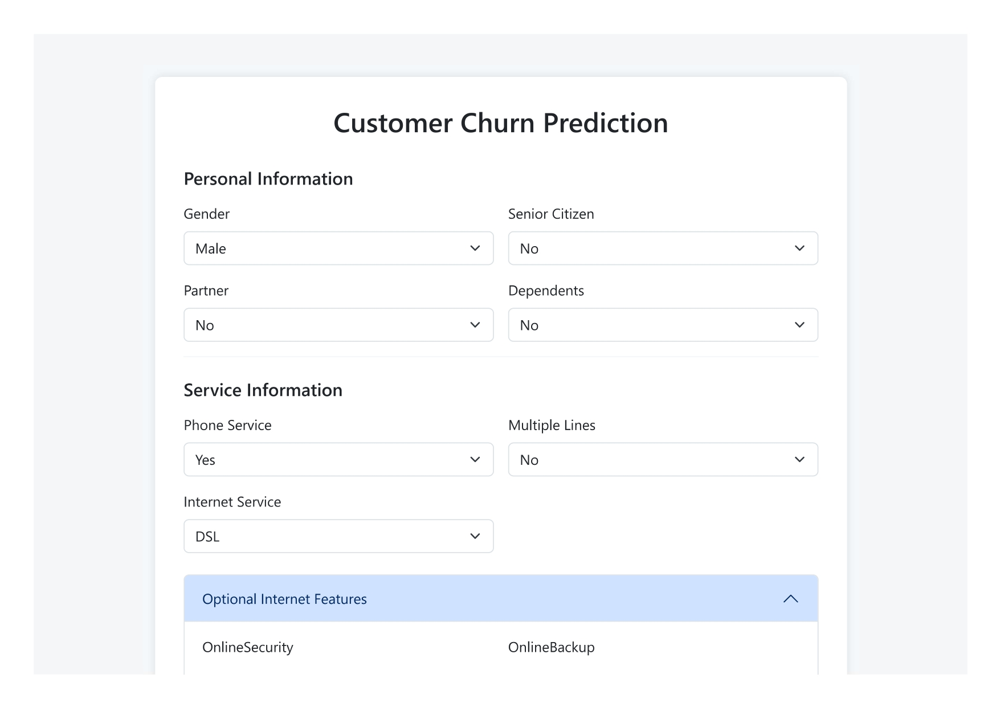
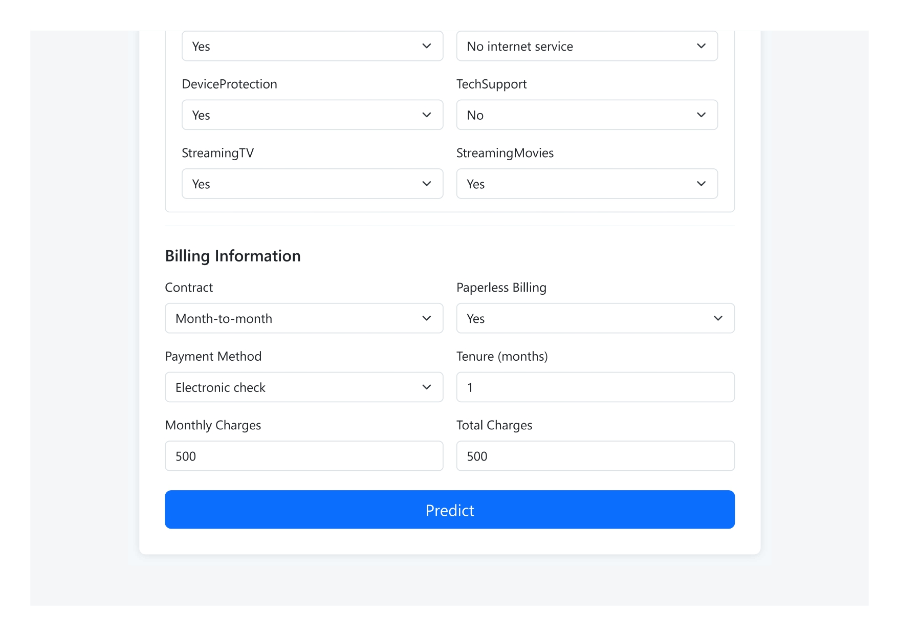
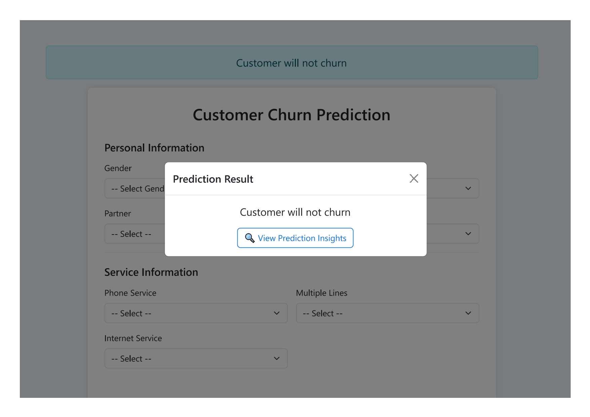
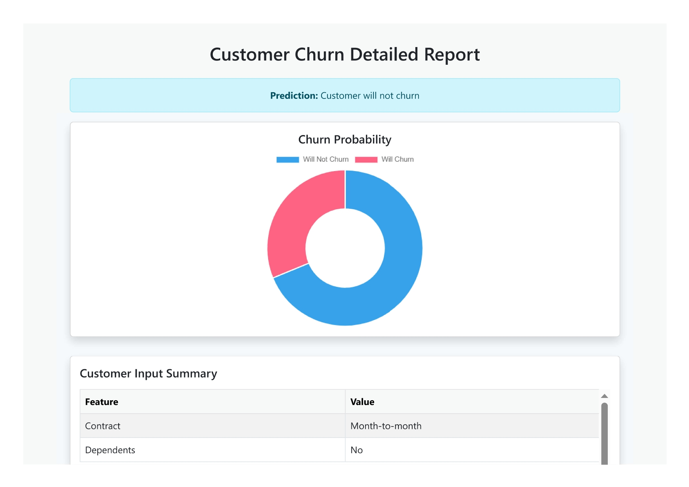
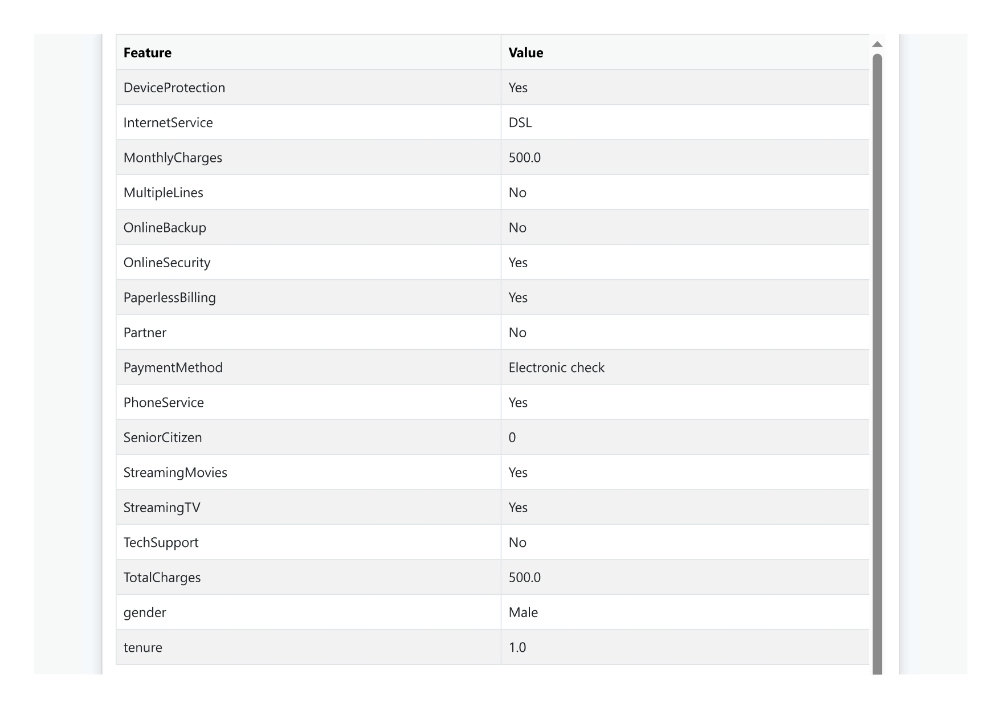
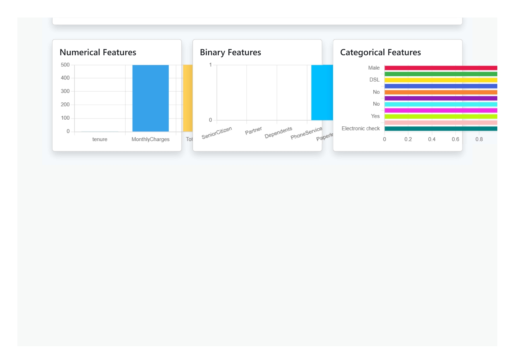

# 📊 Customer Churn Prediction using ML and Flask

This project demonstrates a complete end-to-end machine learning pipeline built with an industry-standard architecture. It follows a modular approach where the data ingestion, preprocessing, training, and deployment workflows are well-structured and reusable. The application predicts customer churn for a telecom company using a trained logistic regression model. The frontend is powered by a user-friendly Flask web interface, and the backend ensures dynamic, insightful visual reports for decision-making.

---

© 2025 Vishal Benake. All rights reserved.  
Unauthorized copying, distribution, or modification of this code is prohibited.

---

## 🚀 Demo

### 🖼️ UI Screenshots

<p align="center">
  
  
  
</p>

### 📈 Output & Report Screens

<p align="center">
  
  
  
</p>

---

## 🛠️ How to Run the Project

1. **Clone the repository**  
   ```bash
   git clone https://github.com/vishal-benake/Customer-Churn-Prediction-ML-Flask.git
   cd Customer-Churn-Prediction-ML-Flask
   ```

2. **Create a virtual environment**  
   ```bash
   python -m venv venv
   # On Windows:
   venv\Scripts\activate
   # On macOS/Linux:
   source venv/bin/activate
   ```

3. **Install required dependencies**  
   ```bash
   pip install -r requirements.txt
   ```

4. **Run data ingestion script**  
   ```bash
   python data_ingestion.py
   ```

5. **Run the Flask application**  
   ```bash
   python application.py
   ```

6. **Open your browser**  
   Go to `http://127.0.0.1:5000`

---

## 📈 Prediction Output

- The app predicts whether a customer will **churn or not**.
- The report page provides:
  - User input summary
  - Bar charts for numerical, binary & categorical features
  - Doughnut chart for churn probability

---

## 📌 Requirements

- Python ≥ 3.7  
- Flask  
- scikit-learn  
- imbalanced-learn  
- pandas  
- joblib  
- chart.js (included via CDN)

Install everything with:
```bash
pip install -r requirements.txt
```

---

## 🔗 Connect with Me

###  YouTube  
<a href="https://www.youtube.com/@Code-With-Vishal">Follow me on YouTube – Code With Vishal</a>

###  Instagram  
<a href="https://www.instagram.com/vishaal_87">Follow me on Instagram – @vishaal_87</a>

---

© 2025 Vishal Benake. All rights reserved.  
Unauthorized copying, distribution, or modification of this code is prohibited.
